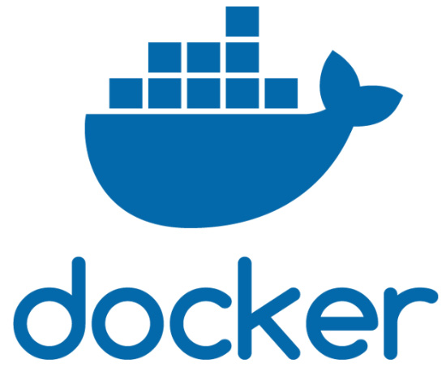
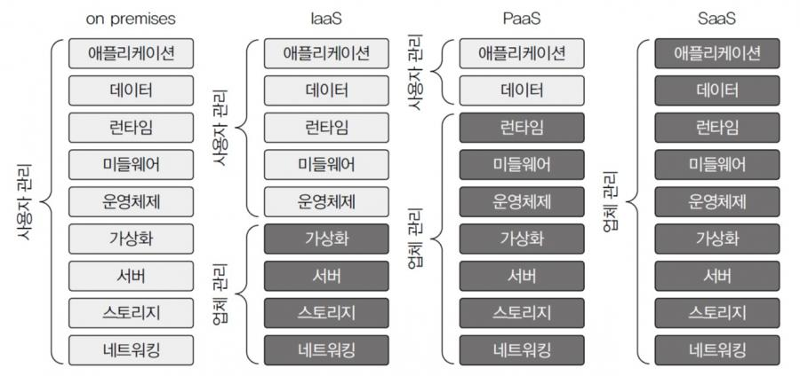
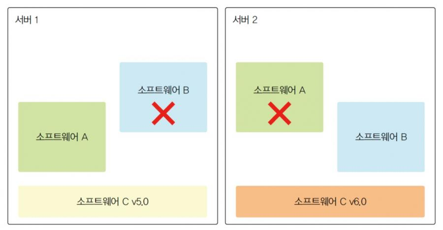
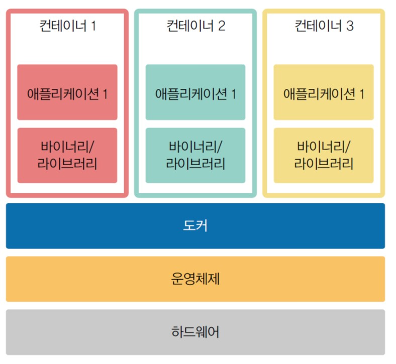
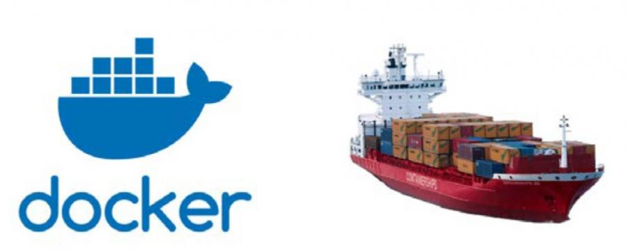
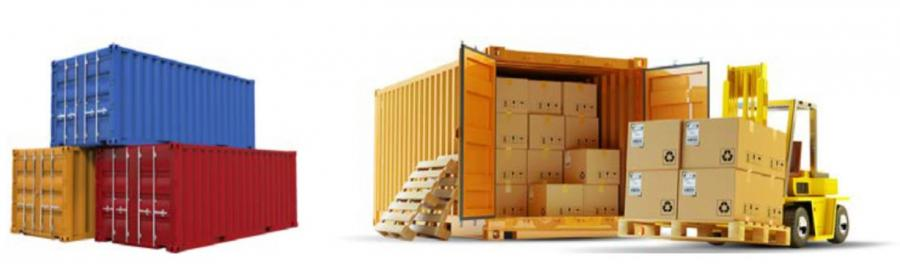
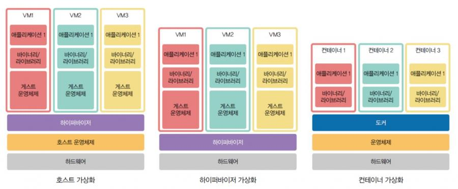
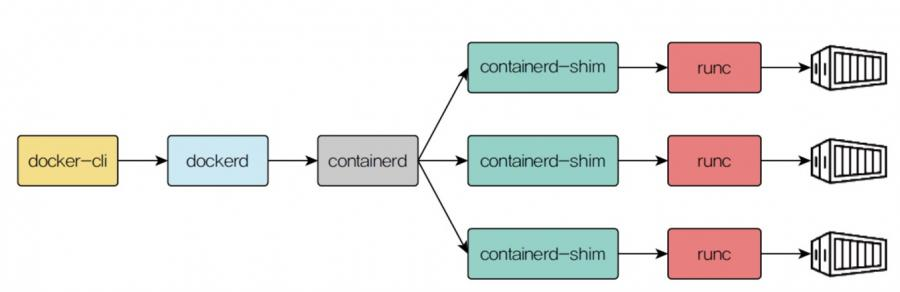

 
    <a href="./README.md">[INDEX]</a>

---
## Docker 개념

### 1. 도커(Docker)

1-1. Docker Company 
- 회사로서의 도커는 최초 2008년 솔로몬 하익스Solomon Hykes가 프랑스 파리에서 닷클라우드 `DotCloud` 라는 이름으로 설립
- 2013년 9월 19일에 `PaaS(Platform-as-a-Service)`의 형태로 출시
 
 

1-2. Docker Software (Open Source)
- 컨테이너(Container)라고 부르는 운영체제 수준의 가상화 방식으로 소프트웨어를 배포하는 방식을 사용하는 PaaS 제품을 의미
- PaaS는 `Platform as a Service`의 줄임말로,
`애플리케이션, 데이터 단계만 사용자가 관리하는 서비스`를 의미
- 쉽게 말해, 도커를 사용하면 다양한 개발 환경에서 컨테이너를 이용해 소프트웨어를 편리하게 배포할 수 있다. 

 
 

1-3. 소프트웨어 배포의 문제점
#### `[Situation]` 소프트웨어 A와 소프트웨어 B를 서버 1과 서버 2에 설치하는 상황을 가정

 
> ▸ 서버 1에는 소프트웨어 C 버전 5.0이 설치되어 있고 서버 2에는 소프트웨어 C 버전 6.0이 설치되어 있다.  
> ▸ 소프트웨어 A는 소프트웨어 C 버전 5.0에서 작동하고, 소프트웨어 B는 소프트웨어 C 버전 6.0에서 작동한다고 하면, 소프트웨어 A는 서버 1에서는 작동하지만 서버 2에서는 작동하지 않는다.  
> ▸ 반면 소프트웨어 B는 서버 1에서는 작동하지 않지만 서버 2에서는 작동한다.  
> ▸ 이런 경우 도커를 사용해 소프트웨어 C를 버전에 따라 각각 다르게 격리시키면 하나의 서버에 소프트웨어 A와 B 모두 설치할 수 있다.

#### `[Solution]`

> ▸ 운영체제 위에 도커가 설치되고 도커는 컨테이너 단위로 애플리케이션을 실행하게 되는데 컨테이너들은 서로 격리되어 있으므로 독립성을 보장  
> ▸ 각 컨테이너는 애플리케이션을 실행하는 데 필요한 최소한의 바이너리, 라이브러리를 포함
  
 

### 2. 컨테이너의 개념
- 도커와 화물선의 컨테이너
> ▸ 화물선에 화물을 무작위로 적재하는 것이 아니라, 일반적으로 '컨테이러'라는 상자에 넣어서 적재

 

- SW개발에서도, `컨테이너`는 소프트웨어를 배포 시
> ▸ `필요한 코드, 라이브러리, 환경설정파일 등`을 한데 모아 격리시킨 후 `실행가능한 패키지로 만든것`을 의미  
> ▸ 서로 다른 컨테이너는 격리된 환경에서 작동되므로 서로 충돌하지 않는다는 장점이 있다.  
> ▸ 이러한 컨테이너의 개념은 소프트웨어 시스템을 구축할 때 최소 구성 요소로 분할하여 구축하는 방식인 `마이크로서비스 아키텍처(Microservice Architectgure)`의 기반 
 

> ▸ 격리된 서로 다른 컨테이너들끼리는 통신을 주고받을수 있다.  
> ▸ 이는 컨테이너가 동일한 운영체제 위에서 작동하기 때문에 가능  
> ▸ 이러한 작동 원리는 가상머신에 비해 리소스 소모량이 적으므로 더 효율적인 리소스 관리가 가능
 
 

### 3. 가상화의 개념
- 도커를 이해하려면 `가상화(Virtualization)`의 개념을 먼저 이해해야 한다.  
> ▸ 컴퓨터에서 활용하는 리소스를 추상화하는 개념을 의미하는 용어  
> ▸ 가상화 개념을 활용해 여러 개의 가상머신을 생성함으로써, 단일 컴퓨팅 자원을 여러 개의 논리적인 자원으로 나누어 동작시킬 수 있음

- 가상화의 종류

#### 3-1. 호스트 가상화 방식
- 운영체제를 설치한 후 하이퍼바이저를 통해 가상머신을 만들고 각 가상머신 내부에는 게스트 운영체제가 설치된다.
- 이때 `하이퍼바이저(Hypervisor)`란 단일 물리 머신에서 다수의 가상머신을 실행할 때 활용하는 소프트웨어를 의미
- 종류 : `버추얼박스(virtualbox), VM웨어(vmware)` 등
- 일반적으로 호스트 가상화 방식을 많이 사용합니다.

#### 3-2. 하이퍼바이저 가상화 방식
- 호스트 가상화와는 달리 호스트 운영체제를 필요로 하지 않는 방식에 해당
- 호스트 운영체제가 존재하지 않으므로 `부팅 시 가상머신을 선택`하게 된다.
- 장점 : 성능이 우수
- 단점 : 초기 설정이 복잡하고 관리가 어려움

#### 3-3. 컨테이너 가상화 방식
- 운영체제 위에 컨테이너를 운영하기 위해 필요한 `도커를 설치한 후 다수의 컨테이너를 통해 애플리케이션을 실행`하는 방식
- `도커, 쿠버네티스`는 컨테이너 가상화 방식을 활용하는 소프트웨어
- 컨테이너 가상화 방식을 사용하면 컨테이너 간 격리가 되기 때문에 다른 애플리케이션에 영향을 미치지 않아 서로 다른 컴퓨팅 환경에서 애플리케이션을 실행하는 데 용이
 
 

### 4. 도커 구성 요소
- 컨테이너가 실행되기까지 필요한 구성요소를 나타낸 그림

- **docker-cli** : 도커 클라이언트(Docker Client)
> - 도커 클라이언트는 이후 실습에서 우분투에서 실행하는 터미널이라고 생각하면 편하다. 
> - 그리고 도커 클라이언트는 명령어 행으로 dockerdAPI를 활용해 build, pull, run과 같은 명령을 내린다. 
> - 또한 도커 클라이언트는 도커 데몬(Docker Daemon)과 통신한다.

- **dockerd** : 도커 데몬
> - 백그라운드에서 실행되는 데몬 프로세스에 해당
> - 도커 데몬은 도커 API 요청을 수신하고 도커 이미지, 컨테이너 등과 같은 도커와 관련된 객체를 관리한다.

- **containerd** : 컨테이너 실행과 관리에 필요한 기능을 수행하는 오픈소스 컨테이너 런타임  
> ▸ containerd는 컨테이너의 생명주기를 모두 관리  
> ▸ 생명주기 : 도커 이미지 전송, 컨테이너 실행, 스토리지, 네트워크 등을 포함  
> ▸ 컨테이너 실행만 담당하는 runc와는 다른 역할을 하며 고수준 컨테이너 런타임(High-Level Container runtime)에 해당한다

- **runc** : 컨테이너 실행과 관련된 작업을 수행하는 저수준 컨테이너 런타임(Low-Level Container runtime)  
> ▸ containerd는 실행 이외에도 컨테이너 관리를 위한 다양한 역할을 하지만, runc는 실제 컨테이너 실행만 담당한다.

- containerd-shim : containerd와 runc 사이에서 작동하는 중간 프로세스에 해당  
> ▸ 컨테이너 실행을 조정하는 역할  
> ▸ containerd는 runc와 통신함으로써 컨테이너를 실행한다.  
> ▸ 이때, containerd-shim이 containerd와 runc 사이에서 중개자 역할을 수행

