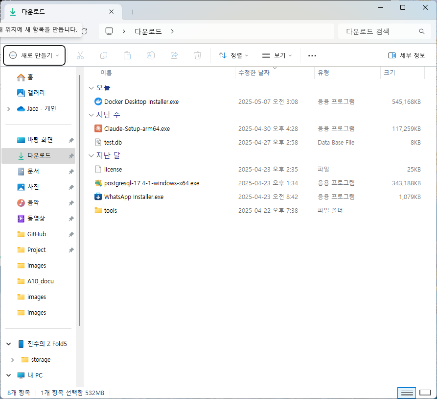
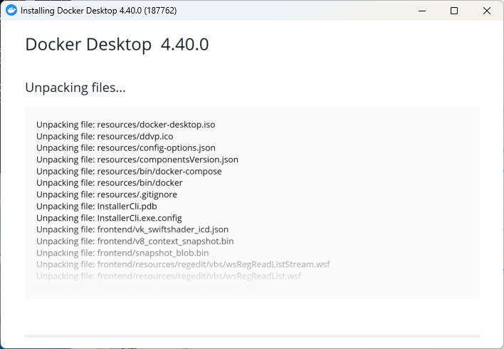
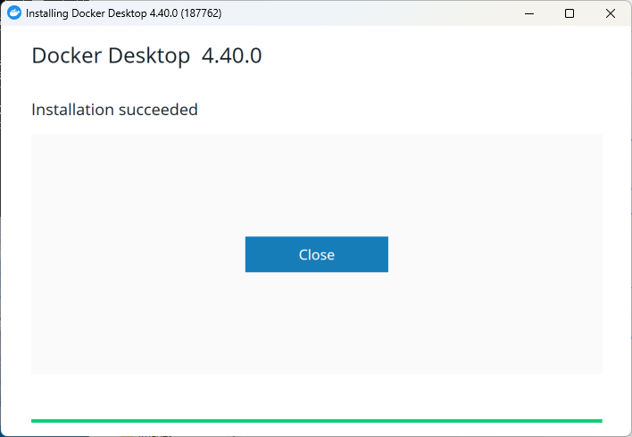

### INDEX
- [1. Docker 개념         ][link-docker10]
- [2. Docker 명령어       ][link-docker20]
- [3. Docker 설치         ][link-docker30]

[link-docker10]: ./D10_Docker개념.md
[link-docker20]: ./D20_Docker명령어.md
[link-docker30]: ./D20_Docker설치.md


---
## Docker 설치
> OS 환경 : Windows 11 Home (64bit) <br/>
> SW 환경 : Docker Desktop 4.40.0 <br/>
> 방법 : Windows 11 Home에 Docker 설치 가이드
> - 윈도우 10 버전 2004(빌드 19041 이상)이나 윈도우 11에는 기본적으로 wsl 명령어가 포함되어있음
> - 만약 윈도우 10 2004 이전버전인 경우 wsl 을 설치해줘야함
> 
<br/>

- 파워셸을 관리자 모드로 실행 후 install 명령 수행
```powershell
PS C:\windows\system32> wsl --install
다운로드 중: Ubuntu
설치 중: Ubuntu
```
cf. 참고 : https://www.lainyzine.com/ko/article/a-complete-guide-to-how-to-install-docker-desktop-on-windows-10/#google_vignette
<br/>

- 설치완료 후 wsl 버전 기본값을 2로 변경
```powershell
PS C:\windows\system32> wsl --set-default-version 2
WSL 2와의 주요 차이점에 대한 자세한 내용은 https://aka.ms/wsl2를 참조하세요
작업을 완료했습니다.
```
<br/>

- 파워쉘 실행 후 wsl 버전 확인
```powershell
PS C:\windows\system32> wsl --version
WSL 버전: 2.4.13.0
커널 버전: 5.15.167.4-1
WSLg 버전: 1.0.65
MSRDC 버전: 1.2.5716
Direct3D 버전: 1.611.1-81528511
DXCore 버전: 10.0.26100.1-240331-1435.ge-release
Windows 버전: 10.0.26100.3775
```
<br/>

- Docker Desktop for Windows - x86_64 선택하여 다운로드
> https://www.docker.com/products/docker-desktop
<br/>

- Docker Desktop for Windows - x86_64 선택하여 다운로드

<br/>

- 다운로드 받은 파일 실행

<br/>

- Configuration에서 OK 선택 후, 설치 중

<br/>

- 설치 완료 후 Close, 윈도우 Restart (컴퓨터 재기동)

<br/>
