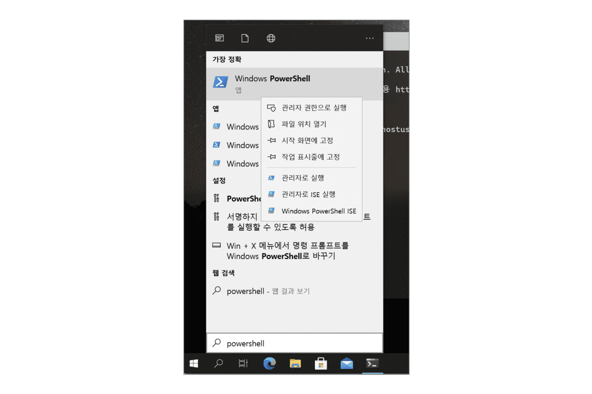

<p style="text-align: right"> 
    <a href="./README.md">[INDEX]</a>
</p>

---
## 윈도우에 WSL2 설치하는 방법(최신)
윈도우 10 버전 2004(빌드 19041 이상) 이상이나 윈도우 11에서는 wsl 명령어 하나로 WSL2를 설치할 수 있습니다.

WSL2를 설치하기 위해서는 터미널 앱을 사용해야합니다. PowelShell을 사용해도 무방합니다만, 윈도우 터미널 사용을 추천합니다. 윈도우 터미널은 WSL2를 활용할 때도 필요하기 때문에 미리 설치하는 것을 추천합니다.

관련 글: [윈도우 터미널(Windows Terminal) 소개 및 사용법][link-window_terminal]

[link-window_terminal]: [https://www.lainyzine.com/ko/article/how-to-install-windows-terminal-powershell-wsl2/]

먼저 윈도우 터미널이나 PowerShell을 관리자 권한으로 실행해주세요. Windowsn + S 키로 윈도우 터미널이나 PowerShell을 검색한 후 오른쪽 버튼을 눌러 ’관리자로 실행’을 선택합니다.

관련 글: 관리자 모드로 명령 프롬프트, Windows Terminal 등 실행하는 방법


PowerShell을 검색해서 관리자 권한으로 실행

다음 명령어를 실행합니다.
```powershell
$ wsl --install
```

설치가 끝나고 다음 명령어를 실행해, WSL 버전 기본값을 2로 변경해줍니다.
```powershell
$ wsl --set-default-version 2
```

바로 ‘마이크로소프트 스토어에서 우분투 리눅스 설치’ 절로 넘어가주세요.
<br/>
<br/>

## 윈도우에 WSL2 수동 설치하는 방법(예전 방법)

wsl 명령어가 없거나, 정상적으로 설치가 되지 않는다면 수동으로 한 단계 씩 WSL2를 설치해야합니다.

### DISM으로 WSL 관련 기능 활성화
먼저 DISM(배포 이미지 서비스 및 관리) 명령어로 Microsoft-Windows-Subsystem-Linux 기능을 활성화합니다.

```powershell
$ dism.exe /online /enable-feature /featurename:Microsoft-Windows-Subsystem-Linux /all /norestart
버전: 10.0.19041.844

이미지 버전: 10.0.19043.928
기능을 사용하도록 설정하는 중
[==========================100.0%==========================]
```

다음으로 dism 명령어로 VirtualMachinePlatform 기능을 활성화합니다.
```powershell
$ dism.exe /online /enable-feature /featurename:VirtualMachinePlatform /all /norestart
배포 이미지 서비스 및 관리 도구

이미지 버전: 10.0.19043.928

기능을 사용하도록 설정하는 중
[==========================100.0%==========================]
작업을 완료했습니다.
```
작업이 정상적으로 완료되었는지, 메시지를 꼭 확인해주세요. 터미널이 관리자 권한이 아닌 경우 작업이 실패합니다. 작업이 정상 완료되었다면 이 시점에 재부팅을 한 번 해줍니다.
<br/>
<br/>

### WSL2 Linux 커널 업데이터
다음으로 WSL2 Linux 커널 업데이트를 진행해야합니다. 첫 번째로 링크는 마이크로소프트의 공식 WSL2 설치 가이드이며, 두 번째 링크는 이 문서에 포함된 wsl_update_x64.msi 파일입니다. 아래 파일을 다운로드 받아 안내에 따라 설치를 진행합니다.

- [Windows 10에 WSL 설치 | Microsoft Docs][link-WSL2_커널업데이터1]
- [x64 머신용 최신 WSL2 Linux 커널 업데이트 패키지][link-WSL2_커널업데이터2]

[link-WSL2_커널업데이터1]:https://learn.microsoft.com/ko-kr/windows/wsl/install#step-4---download-the-linux-kernel-update-package

[link-WSL2_커널업데이터2]: https://wslstorestorage.blob.core.windows.net/wslblob/wsl_update_x64.msi
