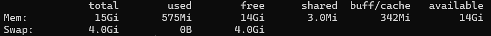

<p style="text-align: right"> 
    <a href="./README.md">[INDEX]</a>
</p>

---
## WSL2 설치

- Windows 11에서 WSL2 설치하기
- CUDA 환경 설정하기 (CUDA Toolkit, CuDNN)
- Linux에서 Conda 가상환경 사용하기
- 새 계정 추가하기


---
## 1. Windows 11에서 WSL2 설치하기

Windows11에서 WSL2를 설치하는 방법에 관한 글이 이미 많이 있지만, 몇 번 설치해보니 여러 테크 블로그에서 안내하는 방법보다 [WSL 공식문서][link-wsl_docs] 에서 안내해주는 방법으로 설치하는 것이 오류도 적고 제일 좋아서 글을 써본다.

### 1. Windows 기능 켜기/끄기
먼저 Windows11에서 Linux를 사용하기 위한 설정을 활성화해주어야 한다.

일반적으로 `Hyper-V`와 `Linux용 Windows 하위 시스템` 두 가지를 활성화할 것을 권장한다. <br/>
`Hyper-V`의 경우 Windows11 Pro 버전에서만 지원해 Home 버전에서는 우회적으로 설치해야한다. 단, WSL2는 `Hyper-V`를 활성화하지 않아도 동작하므로, 이 글에서는 활성화하지 않는다.

1.2. Windows 기능창을 이용한 활성화 방법이 보편적으로 알려져있지만, 직접 해보니까 Powershell이 더 간단했다!
<br/>

### 1.1. Powershell을 이용한 활성화
Windows Powershell을 관리자 권한으로 열고 다음 명령어를 입력하면, Linux용 Windows 하위 시스템이 활성화된다.
```
dism.exe /online /enable-feature /featurename:Microsoft-Windows-Subsystem-Linux /all /norestart
```
Virtual Machine 플랫폼 옵션 기능도 활성화해준다.
```
dism.exe /online /enable-feature /featurename:VirtualMachinePlatform /all /norestart
```
<br/>

### 1.2. Windows 기능창을 이용한 활성화

> Windows 기능창 여는 방법
> 1. Windows11 검색 > Windows 기능 켜기/끄기 클릭
> 2. 제어판 > 프로그램 > 프로그램 및 기능 > Windows 기능 켜기/끄기 클릭 
> <br/>
> 
<br/>
<br/>

### 2. WSL2 설치

다음으로 WSL을 설치하자.
Windows Powershell을 관리자 권한으로 실행한 뒤 다음 명령어를 입력한다.

```
wsl.exe --install # WSL 설치
wsl.exe --update # 최신 버전으로 업데이트
wsl --set-default-version 2 # WSL2을 기본 버전으로 설정
```

보통 wsl --install만 알려주는 경우가 많았는데, 최신 버전으로 업데이트를 하지 않으면 다음과 같은 오류가 발생할 수도 있으므로 꼭 업데이트와 기본 버전 설정까지 함께해주자.
```
Installing, this may take a few minutes...
WslRegisterDistribution failed with error: 0x800701bc
Error: 0x800701bc WSL 2? ?? ?? ?? ????? ?????. ??? ??? https://aka.ms/wsl2kernel? ??????.

Press any key to continue...
```
<br/>
<br/>

### 3. Ubuntu 설치
다음 명령어로 설치가능한 배포판을 알아볼 수 있다.
```
wsl --list --online
```


현재 배포되는 목록에서 원하는 버전을 설치한다.
```
wsl --install -d Ubuntu-20.04
```

최신 버전은 문제가 생겼을 때 해결하기 어려울 때가 많았고, 오래된 버전은 더 이상 지원하지 않는 경우도 많아서 무난하게 Ubuntu-20.04 버전으로 설치했다.


설치가 완료되면 자동으로 Ubuntu-20.04가 실행되며 계정명과 비밀번호를 설정하게 된다.

이제 Windows11에서 Ubuntu-20.04를 찾아볼 수 있다.
<br/>
<br/>

### 4. Ubuntu에서 VSCODE 실행
VSCODE에 접속한 뒤 Connect to WSL 기능을 사용해도 좋지만, 경험 상 Ubuntu에서 직접 다음 명령어를 입력할 때가 더 수월하고 오류가 적었다.
```
code .
```

이 명령어를 실행하면 VSCODE for Linux를 자동으로 설치한 뒤 VSCODE 창까지 열어주어 간편하다.
<br/>
<br/>

### 5. Vmmem 메모리 점유율 제한하기
최근에 알게된 것. WSL2에서 메모리 램을 굉장히 많이 차지하는게 어쩔 수 없다고 생각했는데, 알고보니 실제로는 사용하지 않아도 명목 상 잡고 있는 것이었다.

다음 코드로 현재 WSL2가 메모리를 얼마나 많이 사용하고 있는지 확인할 수 있다
```
free -h
```
내 경우에는 현재 딥러닝 코드를 하나 실행 중이어서 그런가 메모리를 꽤나 꽤 사용하고 있는 편이다. 하지만 20GiB의 여유가 있음을 알 수 있다. 만약 컴퓨터의 메모리 사양이 좋지 않는데 20GiB나 낭비하고 있다면...

물리적으로 WSL2의 메모리 사용량 상한선을 걸어 줄 수 있다.

먼저 C:\Users\<사용자>의 경로로 이동한다. windows+R 키를 누른 뒤 %USERPROFILE%를 입력하면 해당 경로로 빠르게 이동할 수 있다.

경로에 .wslconfig 파일을 생성하고 다음과 같은 내용을 입력한다.
```
[wsl2]
memory=16GB
swap=4GB
```

- memory: VM 메모리를 16GB로 제한
- swap: SSD 용량을 가상 RAM으로 활용하는 정도를 4GB로 제한

다른 config는 [Windows의 공식 문서][link-wsl_config]를 참고하자.

이후 Windows Terminal에서 wsl --shutdown 등의 명령어를 이용해 WSL2를 재시작해준다. 상한선이 제대로 적용된 것을 확인할 수 있다.



<br/>
<br/>

### 6. Ubuntu에서 Git 설치
마지막으로 Git을 깔아준다.
```
sudo apt-get install git
```
드디어 Linux 환경에서 Git을 관리할 수 있다!!!


<br/>
<br/>
<br/>
<br/>
<br/>
---
참조 :  [WSL2. Windows 11에서 WSL2 설치하기][link-WSL2]

[link-WSL2]: https://velog.io/@gynchoi17/WSL2-Windows-11%EC%97%90%EC%84%9C-WSL2-%EC%84%A4%EC%B9%98%ED%95%98%EA%B8%B0

[link-wsl_docs]: https://learn.microsoft.com/ko-kr/windows/wsl/install-manual

[link-wsl_config]: https://github.com/MicrosoftDocs/wsl/blob/main/WSL/wsl-config.md

